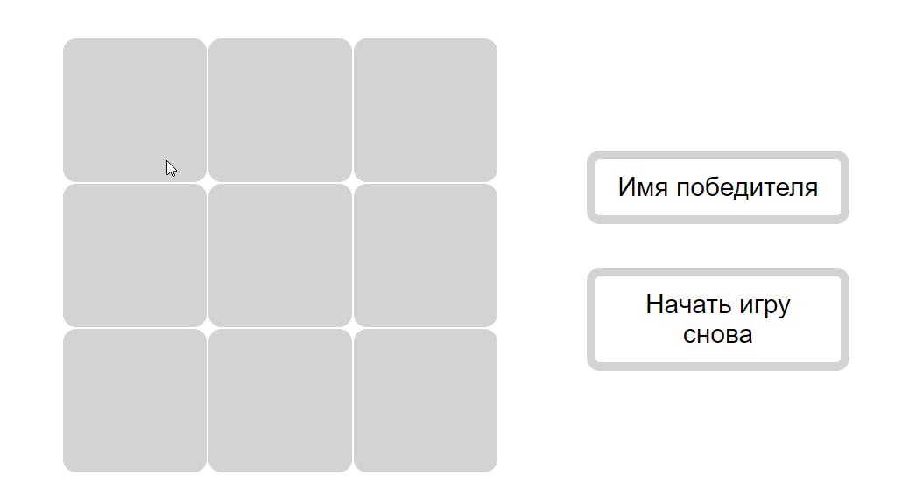

# Игра крестики-нолики

Игра для двух игроков, игроки меняются поочередно. В поле слева выводится значок (X/O) победителя последней игры или ничья. По клику на кнопку "Начать игру снова" игровое поле обновляется. 

Эта работа - мое знакомство с JavaScript. 

[Ссылка на Github Pages](https://n-daria.github.io/Tic-Tac-Toe/)

## Используемые технологии
 1. HTML5, CSS3;
 3. JavaSсript.

 ## Планы по доработке проекта

1. Переписать игру так, чтобы она не зависела от размера поля.  