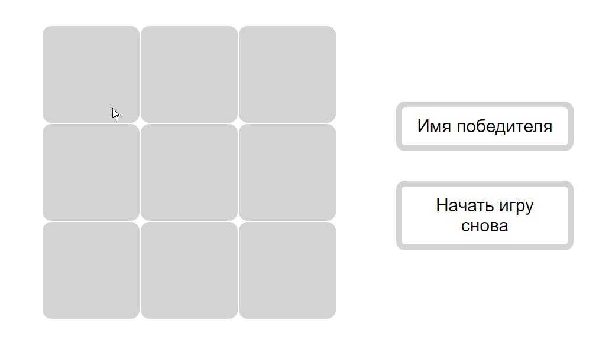

# Игра крестики-нолики

Игра для двух игроков, игроки меняются поочередно. В поле слева выводится значок (X/O) победителя последней игры или ничья. По клику на кнопку "Начать игру снова" игровое поле обновляется. 

## Используемые технологии
 1. HTML5, CSS3;
 3. JavaSсript.

 ## Планы по доработке проекта

1. Реализовать игру для бесконечно большого поля. 